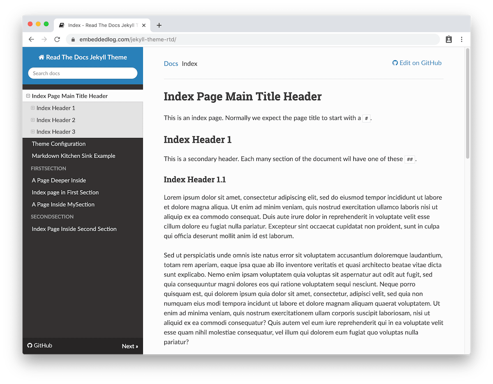

# Read The Docs Theme for Jekyll and GitHub Pages

This is a port of the
[Read The Docs](https://sphinx-rtd-theme.readthedocs.io) theme to
[Jekyll](https://jekyllrb.com/), so that it can be used with GitHub Pages.

You are previewing the theme right now, as you navigate
[this documentation](https://github.com/WilliamTsang-MT/manifoldtech.wiki.github.io):

The original [Read The Docs](https://readthedocs.org)
[theme]((https://sphinx-rtd-theme.readthedocs.io)) was created for the
[Sphinx](https://www.sphinx-doc.org/) documentation generator, and so it is
designed specifically for docs.

Combined with [GitHub Pages](https://pages.github.com) it's a great and easy
way to document your projects!
